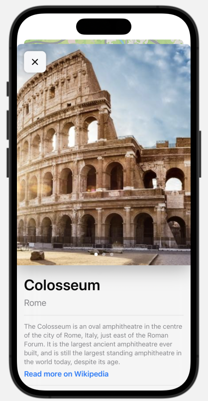

# iOS-Onboarding
2024 iOS Onboarding Project (WIP)

Sourced from [this YouTube Tutorial Series](https://www.youtube.com/watch?v=Jhf3CNs8I-I&list=PLwvDm4Vfkdpha5eVTjLM0eRlJ7-yDDwBk&pp=iAQB)

Amazing Swift [Resource to refer](https://cs193p.sites.stanford.edu/2023)

This mobile app uses the Model-View-ViewModel (MVVM) architecture and makes use of the MapKit package.

  
  

  
